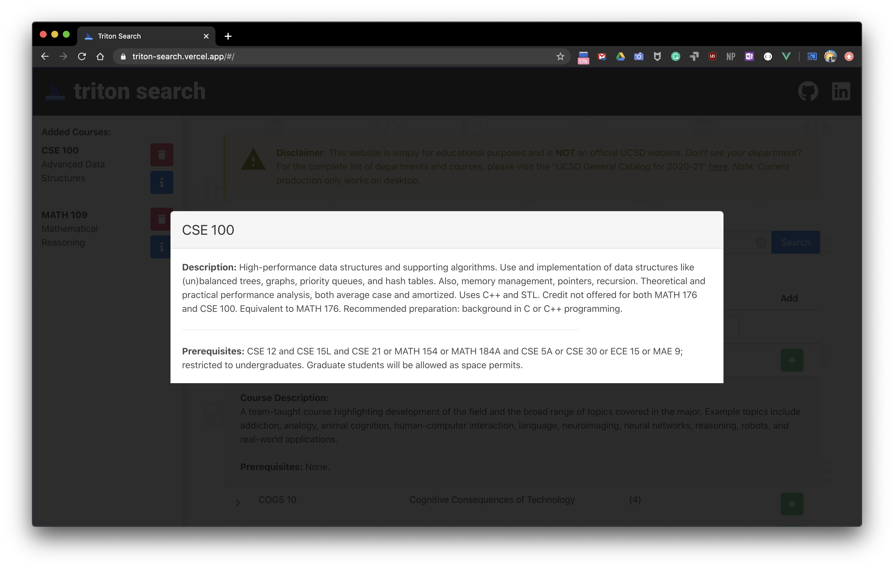

# Full Stack Course Searching Web App (***Triton Search***) with Firebase Firestore, Vue.js/Vuex, Bulma, Buefy, Cheerio.js
* [x] Triton Search App: https://triton-search.vercel.app/

## Web Scraping w/ Cheerio.js
* [x] Scrape all department urls.
  * https://ucsd.edu/catalog/front/courses.html
* [x] Scrape all courses from a given department url.
  * Format: `https://ucsd.edu/catalog/courses/${department}.html`
* [x] Scrape all courses for *all* departments.
* [x] Insert data into Cloud Firestore database!
  * https://firebase.google.com/

## Vue.js/Vuex + Buefy/Bulma
* [x] Create `client` Vue project.
* [x] Create and Add nice background made of icons.
* [x] Create `Navbar` component.
* [x] Create `Footer` component.
* [x] Create `Disclaimer` component.
* [x] Create an `Autocomplete` selection for departments.
* [x] Create a `Table` for the course results.
  * [x] Create detailed rows for course descriptions.
  * [x] Add search filtering to table.
  * [x] Add `Pagination` to table.
  * [x] Create `Add` Button to add courses to `SideBar`.
    * [x] Create `snackbar` notification when adding course.
  * [ ] Sort results by lower division first, then upper division, etc.
* [x] Create a `SideBar` for added courses.
  * [x] Create `Delete` Button to remove selected courses.
    * [x] Create `snackbar` notification when deleting course.
  * [x] Create `Info` Button to display course information.
    * [x] Create `InfoModal` for course information.

## Afterwards
* [x] Fix web scraping issues.
* [x] Update Lucid Chart graph
* [x] Push source code to GitHub.
* [x] Update README.
* [x] NPM Install Vercel CLI.
* [x] Deploy code via Vercel CLI.
* [ ] Fix Button click on Vue Network for mobile.
* [ ] Refactor code.
* [ ] Refine documentation.
* [ ] Set up Google A/B Testing Analytics.

## Resources
* Coding Garden: 
  * Web Scraping: https://www.youtube.com/watch?v=6R7u6EMWaa4/
  * Full Stack Reddit Clone: https://www.youtube.com/watch?v=UjX5ZE359ck/
    * GitHub: https://github.com/CodingGarden/vue-firestore-reddit-clone/
* Favicons: https://icons8.com/
* Vue.js: https://vuejs.org/
* Vuex.js: https://vuex.vuejs.org/
* Bulma: https://bulma.io/
* Buefy: https://buefy.org/
* Lucid Chart: https://app.lucidchart.com/
* Google Fonts: https://fonts.google.com/
* Regular Expressions 101: https://regex101.com/
* Font Awesome: https://fontawesome.com
* Firebase: https://firebase.google.com/
* Cloud Firestore: https://firebase.google.com/products/firestore

## Preview Images

