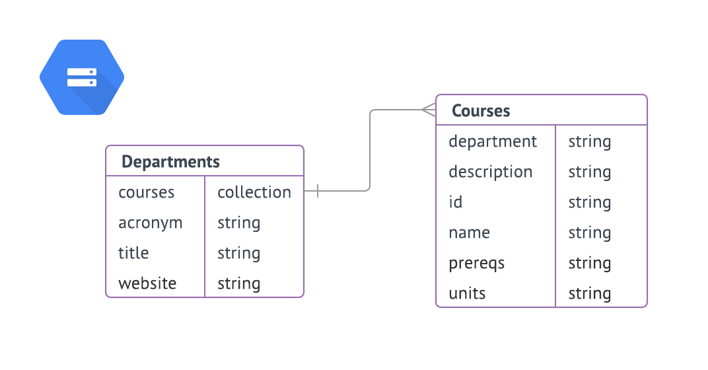
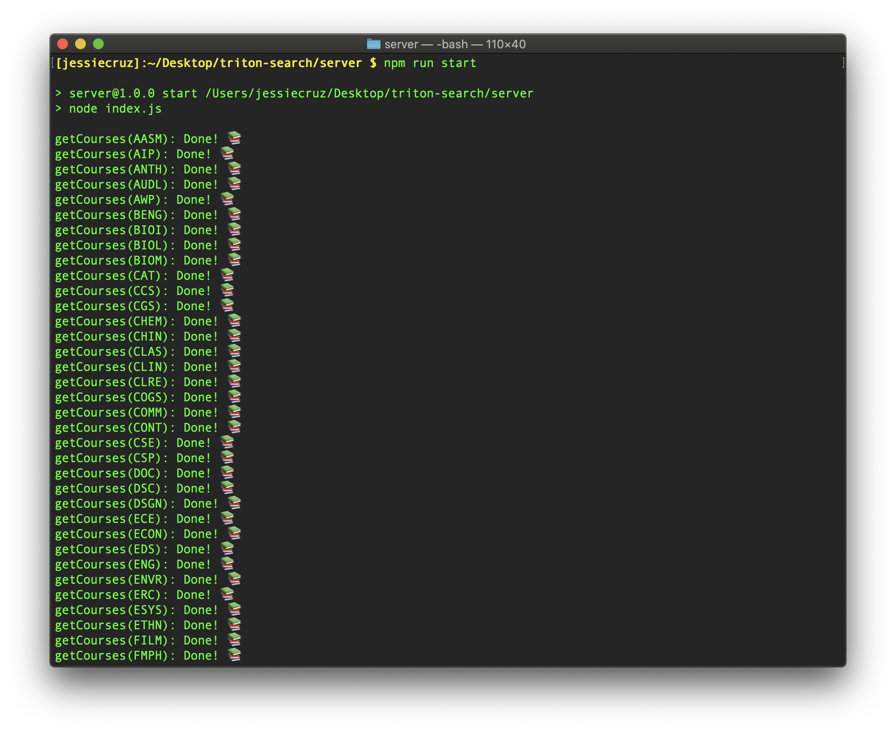
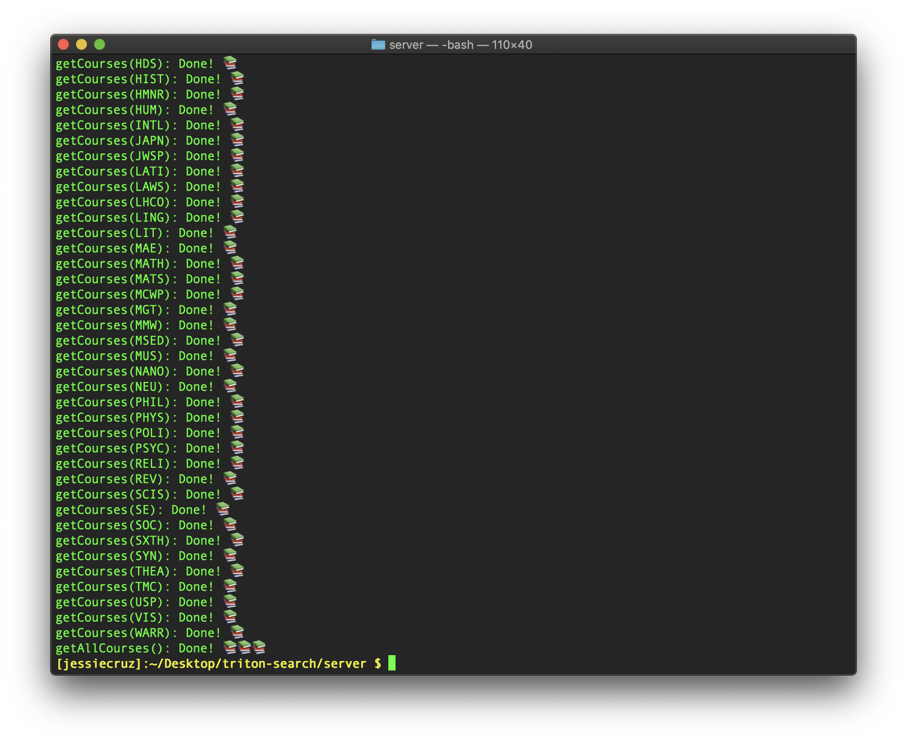
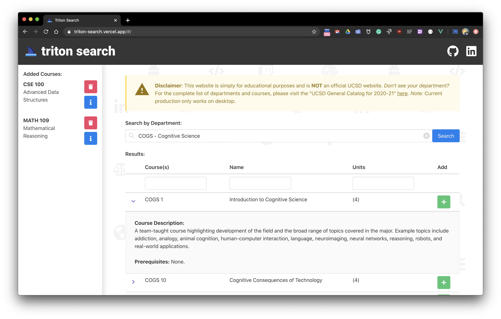

# Full Stack Course Searching Web App (***Triton Search***) with Firebase Firestore, Vue.js/Vuex, Bulma, Buefy, Cheerio.js
* [x] Triton Search App: https://triton-search.vercel.app/

## Web Scraping w/ Cheerio.js
* [x] Scrape all department urls.
  * https://ucsd.edu/catalog/front/courses.html
* [x] Scrape all courses for a given department.
  * Format: `https://ucsd.edu/catalog/courses/${department}.html`
* [x] Scrape all courses for all departments.
* [x] Insert data into Cloud Firestore database!
  * https://firebase.google.com/

## Front-End w/ Buefy + Bulma
* [x] Create client Vue project.
* [x] Create and Add nice background made of icons.
* [x] Create `Navbar`.
* [x] Create `Footer` component.
* [x] Create `Disclaimer` component.
* [x] Create a `Selection` for departments.
* [x] Create a `Table` for course results.
  * [x] Create detailed rows for course descriptions.
  * [x] Add search filtering to table.
  * [x] Add `Pagination` to table.
  * [x] Create `Add` Button to add courses to side bar.
  * [ ] Sort results by lower division first, then upper division, etc.
  * [x] Create `snackbar` notification when adding course
* [x] Create a `SideBar` for added courses.
  * [x] Create `Delete` Button to remove selected courses.
  * [ ] Create `Info` Button to display course information.

## Back-End w/ Vue.js + Vuex.js
* [x] Get all departments from database into `b-select` tags.
* [x] Get all courses from the given department into `b-field` tags.
* [ ] Fix Button click on Vue Network for mobile.

## After
* [x] Push source code to GitHub.
* [x] Fix Lucid Chart graph.
* [x] Install Vercel CLI.
* [x] Fix any web scraping errors.
* [ ] Refactor code.
* [ ] Review and refine README/documentation.
* [ ] Set up Google A/B Testing Analytics.

## Resources
* Coding Garden: 
  * Web Scraping: https://www.youtube.com/watch?v=6R7u6EMWaa4/
  * Full Stack Reddit Clone: https://www.youtube.com/watch?v=UjX5ZE359ck/
* Coding Garden (GitHub): https://github.com/CodingGarden/vue-firestore-reddit-clone/
* Favicons: https://icons8.com/
* Vue.js: https://vuejs.org/
* Vuex.js: https://vuex.vuejs.org/
* Bulma: https://bulma.io/
* Buefy: https://buefy.org/
* Lucid Chart: https://app.lucidchart.com/
* Google Fonts: https://fonts.google.com/
* Regular Expressions 101: https://regex101.com/
* Font Awesome: https://fontawesome.com
* Firebase: https://firebase.google.com/
* Cloud Firestore: https://firebase.google.com/products/firestore

## Images

